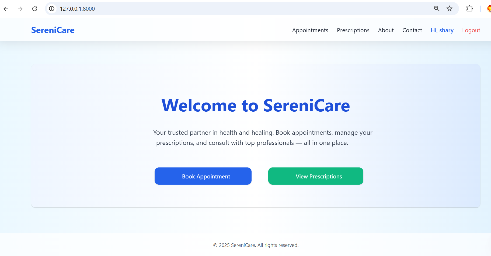
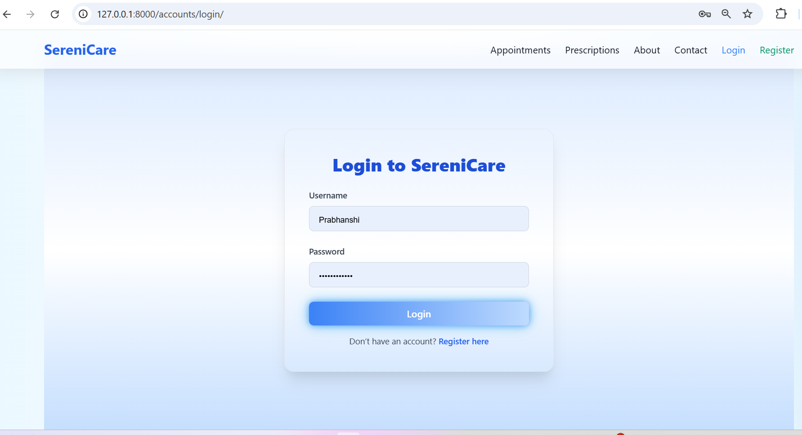
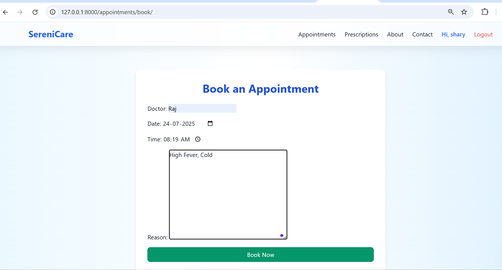
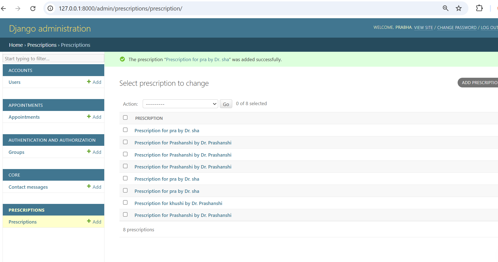
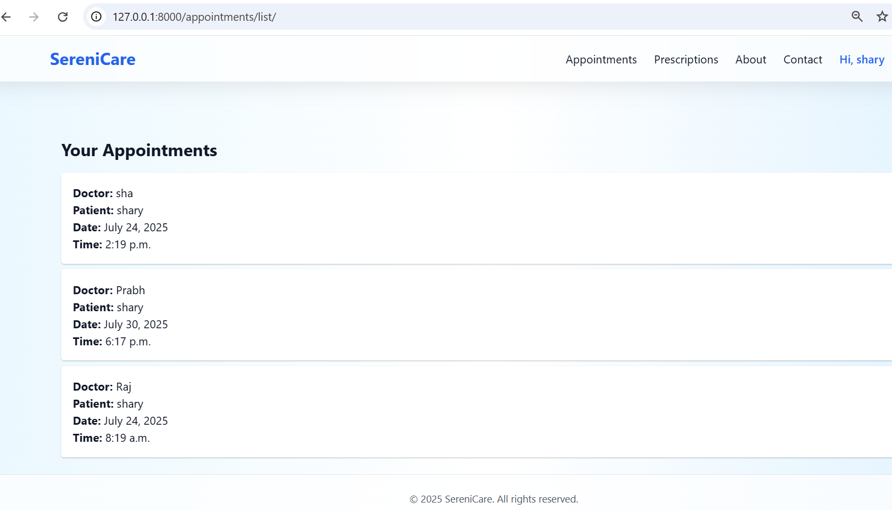

# 🌿 SereniCare – Your Wellness, Digitally Managed
SereniCare is a sleek and professional Django-based health management system that helps patients and healthcare providers manage **appointments, prescriptions, and records** — all in one place.
---

## 🚀 Key Features
- 🩺 **Book Appointments** – Schedule consultations with verified doctors.
- 📋 **Prescription View** – Access past prescriptions securely.
- 👩‍⚕️ **Patient Records** – Maintain health logs and track progress.
- 🔐 **User Authentication** – Secure login, registration & session handling.
- 📊 **Admin Dashboard** – Manage users, appointments, and data.
- 💅 **Modern UI** – Fully responsive with **Tailwind CSS** styling.
- 📁 **Output Image Previews** – See what you get below!

---

## 📸 Output Screenshots

### 🏠 Home Page


### 🔐 Login Page


### 📝 Appointment Booking


### 📄 Prescription Records


### 📂 Patient Record View



---

## 🛠️ Tech Stack

| Layer        | Tech                               |
|--------------|------------------------------------|
| 🧠 Backend   | Python, Django                      |
| 💻 Frontend | HTML, Tailwind CSS, JavaScript      |
| 🗄️ Database | SQLite (can upgrade to PostgreSQL)   |
| 🌍 Deployment | Render / PythonAnywhere / Railway   |

---

## 🧩 Folder Structure (Simplified)


SereniCare/
│
├── accounts/ # User registration & login
├── appointments/ # Appointment models & views
├── prescriptions/ # Prescription handling
├── templates/ # HTML Templates
├── static/outputs/ # Output screenshots
├── db.sqlite3 # Local database
├── manage.py
└── README.md


---

## ⚙️ Setup Instructions

```bash
# 1. Clone the project
git clone https://github.com/yourusername/SereniCare.git
cd SereniCare

# 2. Create and activate virtual environment
python -m venv venv
venv\Scripts\activate     # On Windows

# 3. Install dependencies
pip install -r requirements.txt

# 4. Run migrations
python manage.py migrate

# 5. Create superuser
python manage.py createsuperuser

# 6. Run the server
python manage.py runserver


📧 Contact
Developer: Prabhanshi Yadav

📬 Email: prabhanshi04.com
